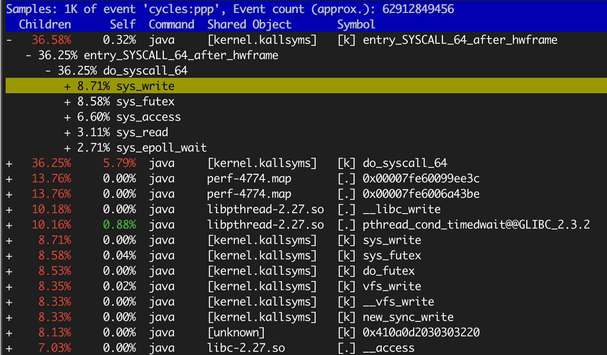
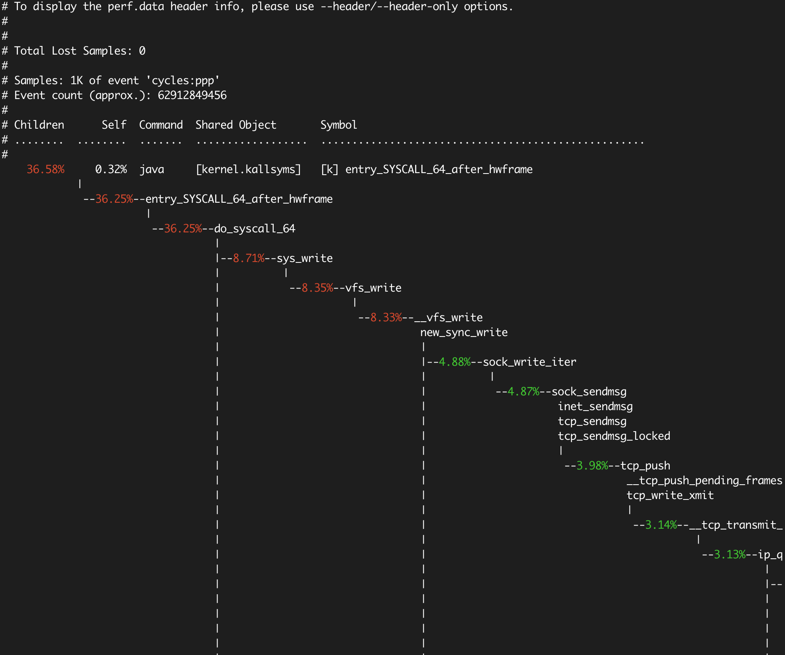
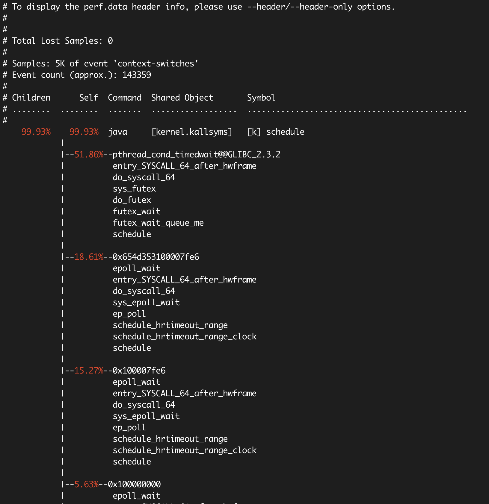
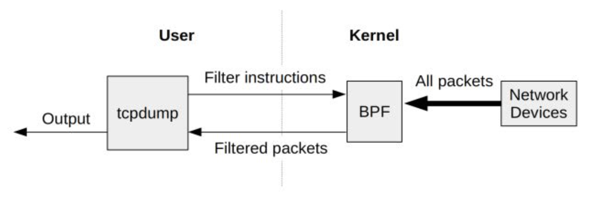
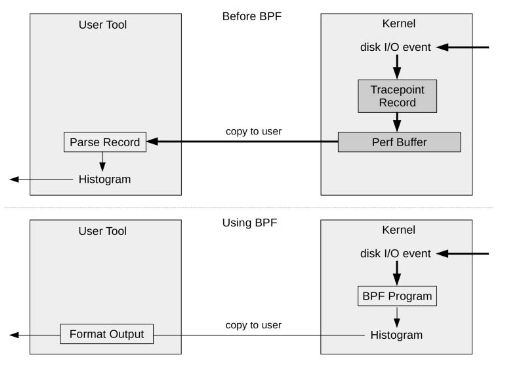
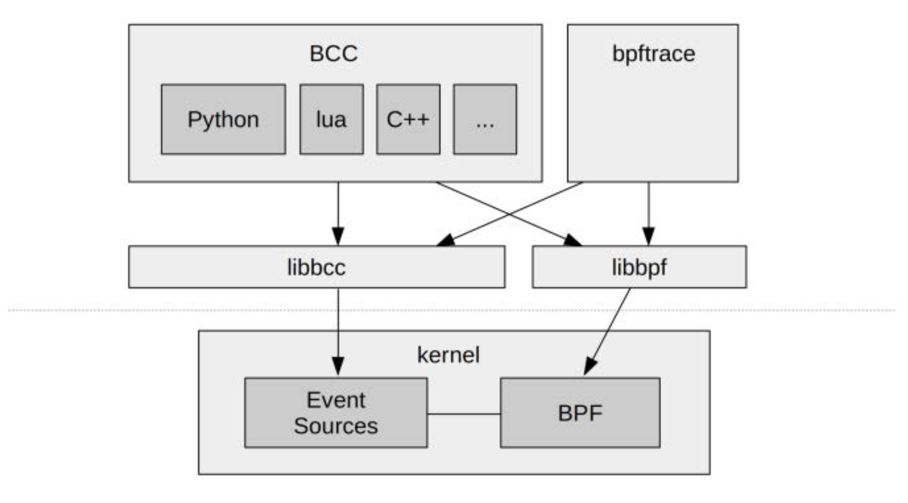

# 使用火焰图进行Java性能分析

## 性能分析工具分类

性能分析的技术和工具可以分为以下几类：

1. **Counters**

内核维护着各种统计信息，被称为`Counters`，用于对事件进行计数。例如，接收的网络数据包数量，发出的磁盘I/O请求，执行的系统调用次数。常见的这类工具有：

* vmstat: 虚拟和物理内存统计
* mpstat: CPU使用率统计
* iostat：磁盘的I/O使用情况
* netstat：网络接口统计信息，TCP/IP协议栈统计信息，连接统计信息

2. **Tracing**

**Tracing**是收集每个事件的数据进行分析。**Tracing**会捕获所有的事件，因此有比较大的CPU开销，并且可能需要大量存储保存数据。常见的**Tracing**工具有：

* tcpdump: network packet tracing
* blktrace: block I/O tracing
* perf: Linux Performance Events, 跟踪静态和动态探针
* strace: 系统调用tracing
* gdb: 源代码级调试器

3. **Profiling**

**Profiling**是通过收集目标行为的样本或快照，来了解目标的特征。**Profiling**可以从多个方面对程序进行动态分析，如CPU、Memory、Thread、I/O等，其中`CPU Profiling`的应用最为广泛。

`CPU Profiling`是基于一定频率对运行的程序进行采样，来分析消耗CPU的代码路径。可以基于固定的时间间隔进行采样，例如每10毫秒采样一次。也可以基于固定速率采样，例如每秒采集100个样本。

`CPU Profiling`经常被用于分析代码的执行热点，如“哪个方法占用CPU的执行时间最长”、“每个方法占用CPU的比例是多少”等等，通过`CPU Profiling`得到上述相关信息后，研发人员就可以轻松针对热点瓶颈进行分析和性能优化，进而突破性能瓶颈，大幅提升系统的吞吐量。

Linux上常用的**Profiling**工具有：

* [perf](https://perf.wiki.kernel.org/index.php/Main_Page)的 [record](https://perf.wiki.kernel.org/index.php/Tutorial#Sampling_with_perf_record) 子命令
* [BPF profile](https://github.com/iovisor/bcc/blob/master/tools/profile.py)

4. **Monitoring**

系统性能监控会记录一段时间内的性能统计信息，以便可以基于时间周期进行比较。这对于容量规划，显示高峰期的使用情况很有用。历史值还为我们理解当前性能指标提供了上下文。监控单个操作系统最常用工具是**sar**（system activity reporter，系统活动报告）命令。sar通过一个agent定期执行来记录系统计数器的状态，并可以使用sar命令查看它们，例如：

```
$ sar
Linux 4.15.0-88-generic (mazhen) 	03/19/2020 	_x86_64_	(4 CPU)

12:53:08 PM       LINUX RESTART

12:55:01 PM     CPU     %user     %nice   %system   %iowait    %steal     %idle
01:05:01 PM     all     14.06      0.00     10.97      0.11      0.00     74.87
01:15:01 PM     all      9.60      0.00      7.49      0.09      0.00     82.83
01:25:01 PM     all      0.04      0.00      0.02      0.02      0.00     99.92
01:35:01 PM     all      0.03      0.00      0.02      0.01      0.00     99.94
```

本文主要讨论如何使用`perf`和`BPF`进行`CPU Profiling`。

## perf

**perf**最初被称为`Performance Counters for Linux`(PCL)，是使用`Linux`性能计数器子系统的工具。`perf`在Linux`2.6.31`合并进内核，位于[tools/perf](https://github.com/torvalds/linux/tree/master/tools/perf)目录下。

随后`perf`进行了各种增强，增加了`tracing`、`profiling`等能力，可以帮助你进行troubleshooting，分析和定位系统的性能问题。

因为`perf`是一个面向事件（event-oriented）的可观察性工具，因此它也被称为`Linux perf events (LPE)`，或`perf_events`。

`perf`支持多个事件源，为内核不同的instrumentation frameworks提供了统一接口。


这些事件源分类为：

* **Hardware Events**: CPU性能监控计数器
* **Software Events**: 基于内核计数器的底层事件。例如，CPU迁移，minor faults，major faults等。
* **Kernel Tracepoint Events**: 静态的内核级`Tracepoint`，已经硬编码在内核的合适位置。
* **User Statically-Defined Tracing (USDT)**: 用户级程序和应用程序的静态跟踪点。
* **Dynamic Tracing**: 动态instrumentation，可以在生产环境中将instrumentation points插入正在运行的软件。`Dynamic Tracing`又分为两类：
  * 对于kernel，使用`kprobes`
  * 对于user-level软件，使用`uprobes`
* **Timed Profiling**: 可以使用`perf record`以任意频率收集快照。这通常用于CPU使用情况的分析，通过创建自定义定时中断事件来工作。

可以使用perf的`list`子命令查看当前可用的事件：

```
$ sudo perf list
List of pre-defined events (to be used in -e):

  branch-instructions OR branches                    [Hardware event]
  branch-misses                                      [Hardware event]
  bus-cycles                                         [Hardware event]
  cache-misses                                       [Hardware event]
  cache-references                                   [Hardware event]
  cpu-cycles OR cycles                               [Hardware event]

...

  alignment-faults                                   [Software event]
  bpf-output                                         [Software event]
  context-switches OR cs                             [Software event]
  cpu-clock                                          [Software event]
  cpu-migrations OR migrations                       [Software event]

...

  alarmtimer:alarmtimer_cancel                       [Tracepoint event]
  alarmtimer:alarmtimer_fired                        [Tracepoint event]
  alarmtimer:alarmtimer_start                        [Tracepoint event]
  alarmtimer:alarmtimer_suspend                      [Tracepoint event]
  block:block_bio_backmerge                          [Tracepoint event]
  block:block_bio_bounce                             [Tracepoint event]
...

```

如果还没有安装`perf`，可以使用`apt`或`yum`进行安装：

```
sudo apt install linux-tools-$(uname -r) linux-tools-generic
```

`perf`支持多个子命令，我们用来进行`CPU Profiling`的是`record`命令：

1. `sudo perf record -F 99 -a -g  sleep 10`

对所有CPU（**-a**）进行call stacks（**-g**）采样，采样频率为99 Hertz （**-F 99**），持续10秒（**sleep 10**）。

2. `sudo perf record -F 99 -a -g  -p PID sleep 10`

对指定进程（**-p PID**）进行采样。

3. `sudo perf record -F 99 -a -g -e context-switches -p PID sleep 10`

`perf`可以和各种`instrumentation points`一起使用，以跟踪内核调度程序（`scheduler`）的活动。其中包括`software events`和`tracepoint event`（静态探针）。

上面的例子会对指定进程的上下文切换进行采样（**-e context-switches**）。

`perf record`的运行结果保存在当前目录的`perf.data`文件中，采样接受后，我们使用`perf report`查看结果。

* **交互式模式**

```
$ sudo perf report
```



以`+`开头的行可以回车，展开详细信息。

* **`--stdio`选项用于打印所有输出**

```
$ sudo perf report --stdio
```



`context-switches`的采样报告：



后面我们会介绍**火焰图**，以可视化的方式展示`stack traces`，比`perf report`更加直观。

## BPF

**BPF**是**Berkeley Packet Filter**的缩写，最初是为BSD开发，第一个版本于1992年发布，[用于改进网络数据包捕获的性能](https://www.tcpdump.org/papers/bpf-usenix93.pdf)。`BPF`是在内核级别进行过滤，不必将每个数据包拷贝到用户空间，从而提高了数据包过滤的性能。`tcpdump`使用的就是`BPF`。



2013年`BPF`被重写，并于2014年包含进`Linux`内核中。改进后的`BPF`成为了通用执行引擎，可用于多种用途，包括创建高级性能分析工具。

`BPF`允许在内核中运行`mini programs`，来响应系统和应用程序事件（例如磁盘I/O事件）。这种运作机制和`JavaScript`类似：`JavaScript`是运行在浏览器引擎中的`mini programs`，响应鼠标点击等事件。`BPF`使内核可编程化，从而使用户（包括非内核开发人员）能够自定义和控制他们的系统，以解决实际问题。

`BPF`由指令集，存储对象和helper函数组成，可以被认为是一个**虚拟机**。`BPF`指令集由位于Linux内核的`BPF runtime`执行，`BPF runtime`包括了解释器和JIT编译器。`BPF`是一种灵活高效的技术，可以用于`networking`，`tracing`和安全等领域。我们重点关注它作为系统监测工具使用。


和`perf`一样，`BPF`能够instruments多种事件源，同时可以通过调用`perf_events`以使用它的功能：


BPF可以在内核运行计算和统计汇总，这样大大减少了复制到用户空间的数据量：



BPF已经内置在Linux内核中，因此你可以在生产环境中使用BPF，而无需再安装任何新的内核组件。

## BCC和bpftrace

直接使用`BPF`指令进行编程非常繁琐，因此很有必要提供高级语言前端方便用户使用，于是就出现了`BCC`和`bpftrace`。



**BCC（BPF Compiler Collection）** 是为`BPF`开发的第一个`higher-level tracing framework`。 `BCC`提供了一个C编程环境，用于编写内核`BPF`代码，此外它还支持`Python`，`Lua`和`C++`作为用户接口。

**bpftrace** 是一个比较新的前端，它为开发`BPF`工具提供了一种专用的高级语言。`bpftrace`适合单行代码和自定义短脚本，而`BCC`更适合复杂的脚本和守护程序。

`BCC`和`bpftrace`没有在内核代码库，而是在GitHub上名为[IO Visor](https://github.com/iovisor)的`Linux Foundation`项目中。

### BCC的安装

`BCC`可以[官方文档](https://github.com/iovisor/bcc/blob/master/INSTALL.md)进行安装。以`Ubuntu 18.04 LTS`为例，建议从源码build安装：

```
# 安装build依赖
$ sudo apt -y install bison build-essential cmake flex git libedit-dev \
  libllvm6.0 llvm-6.0-dev libclang-6.0-dev python zlib1g-dev libelf-dev
$ sudo apt-get -y install luajit luajit-5.1-dev

# Install and compile BCC
$ git clone https://github.com/iovisor/bcc.git
mkdir bcc/build; cd bcc/build
cmake ..
make
sudo make install
cmake -DPYTHON_CMD=python3 .. # build python3 binding
pushd src/python/
make
sudo make install
popd
```

`make install`完成后，`BCC`自带的工具都安装在了`/usr/share/bcc/tools`目录下。`BCC repository`已经包含70多个`BPF`工具，用于性能分析和故障排查。这些工具你都可以直接使用，无需编写任何`BCC`代码。


我们进行`CPU profiling`的工具已经默认提供：

* [tools/profile](https://github.com/iovisor/bcc/blob/master/tools/profile.py): Profile CPU usage by sampling stack traces at a timed interval.

此外，还可以关注[Off-CPU](http://www.brendangregg.com/offcpuanalysis.html)的分析工具：

* [tools/offcputime](https://github.com/iovisor/bcc/blob/master/tools/offcputime.py): Summarize off-CPU time by kernel stack trace

后面会介绍如何与火焰图结合使用。

### bpftrace的安装

TODO

## 火焰图

## Java CPU Profiling

### perf

### BPF

### async-profiler

