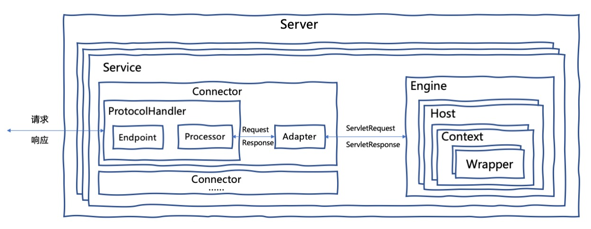
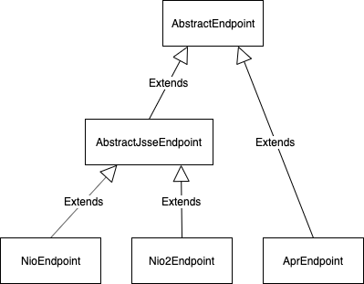
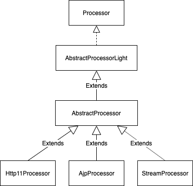
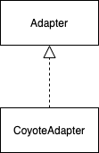
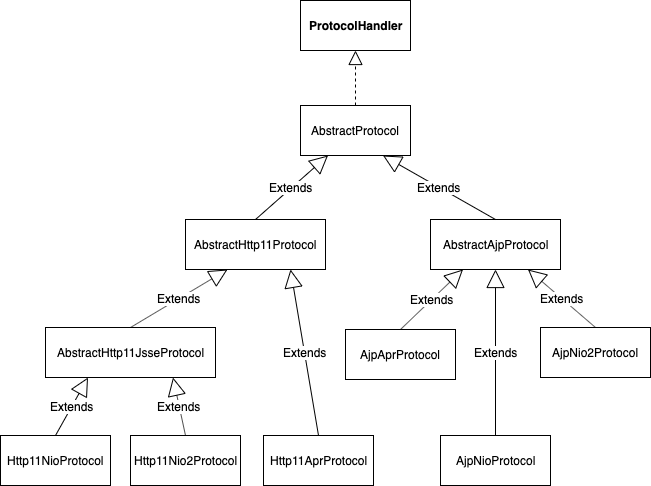

# Tomcat系统架构简介

## Tomcat系统架构图



从架构图可以看出，顶层组件`Server`代表一个Tomcat Server实例，一个`Server`中有一个或者多个`Service`，每个`Service`有多个`Connector`，以及一个`Engine`。

`Connector`和`Engine`是Tomcat最核心的两个组件。

`Connector`负责处理网络通信，以及应用层协议(HTTP，AJP)的解析，生成标准的`ServletRequest`和`ServletResponse`对象，然后传递给`Engine`处理。每个`Connector`监听不同的网络端口。

`Engine`代表整个`Servlet`引擎，可以包含多个`Host`，表示它可以管理多个虚拟站点。`Host`代表的是一个虚拟主机，而一个虚拟主机下可以部署多个Web应用程序，`Context`表示一个Web应用程序。`Wrapper`表示一个`Servlet`，一个Web应用程序中可能会有多个`Servlet`。

从Tomcat的配置文件`server.xml`也能看出Tomcat的系统架构设计。

```
<Server>
  <Service>
    <Connector />
    <Connector />
    <Engine>
      <Host>
      </Host>
    </Engine>
  </Service>
</Server>
```

## `Connector`

我们再仔细看一下`Connector`的内部实现。


* `Endpoint` 负责网络通信
* `Processor` 实现应用层协议(HTTP，AJP)解析
* `Adapter` 将Tomcat的`Request`/`Response`转换为标准的`ServletRequest`/`ServletResponse`

Tomcat的网络通信层支持多种 I/O 模型：

* **NIO**：使用`Java NIO`实现
* **NIO.2**：异步I/O，使用`JDK NIO.2`实现
* **APR**：使用了Apache Portable Runtime (APR)实现



Tomcat实现支持了多种应用层协议：

* **HTTP/1.1**
* **HTTP/2**
* **AJP**：二进制协议，Web Server和Tomcat之间的通信协议



`Processor`解析网络字节流生成Tomcat的`Request`对象后，会调用`Adapter`的`Service`方法。`Adapter`是`Servlet`引擎的入口，`Adapter`负责将Tomcat的`Request`对象转换为标准的`ServletRequest`，然后再调用`Servlet`引擎的`service`方法。



## `ProtocolHandler`

Tomcat允许一个`Engine`对接多个`Connector`，每个`Connector`可以使用不同的 I/O 模型，实现不同的应用层协议解析。`Connector`屏蔽了 I/O 模型和协议的区别，传递给`Engine`的是标准的`ServletRequest`/`ServletResponse`对象。

由于 I/O 模型和应用层协议解析可以自由组合，Tomcat使用`ProtocolHandler`实现这种组合。各种组合都有相应的具体实现类。比如：Http11NioProtocol 和 AjpNio2Protocol。



关于`NioEndpoint`和`Nio2Endpoint`组件的内部实现，会在后续文章进行分析。